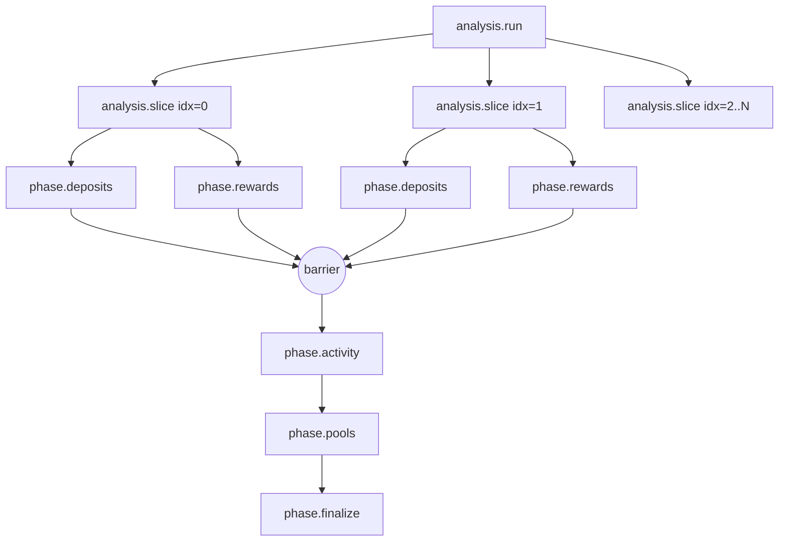

# Contract: Trigger.dev Task Topology (008-analysis-jobs)

**Feature**: `008-analysis-jobs`  
**Date**: 2026-05-24  
**Scope**: Trigger.dev v3 task topology that executes a single analysis run. Locations under `apps/web/src/server/trigger/tasks/`. All payloads are strictly typed; all task IDs are kebab-case namespaced by phase. Citations: `research.md §R6` (DAG), `§R8` (provider boundaries + retry), `§R10` (idempotency keys), `§R12` (Postgres is source of truth), `spec.md` FR-008..FR-053.

## Topology Overview



**DAG rules** (research.md §R6):

- `analysis.run` is the orchestrator. It plans backward slices (research.md §R3), fans out one `analysis.slice` per slice, awaits the **barrier**, then runs `phase.activity → phase.pools → phase.finalize` in series.
- Each `analysis.slice` is independent: it fans out `phase.deposits` and `phase.rewards` for its own window and joins them. Slices may execute in parallel up to per-provider queue limits.
- Phase D (`phase.activity`), Phase E (`phase.pools`), and Phase F (`phase.finalize`) are SINGLETONS per run; they consume aggregated slice output, not per-slice partials (FR-019, FR-022, FR-024).
- A failed slice does NOT poison siblings (FR-034). Phase D/E/F still run; the orchestrator marks `analysis_runs.coverage = 'partial'` and accumulates `coverage_reasons[]`.

---

## Per-Provider Queues (research.md §R8)

All Phase A/B/D/E provider calls go through these queues. `concurrencyLimit` values are env-driven and tuned per plan.

| Queue | Provider | Env var | Default |
|---|---|---|---|
| `moralis` | Moralis discovery | `TRIGGER_QUEUE_MORALIS_CONCURRENCY` | 4 |
| `alchemy-prices` | Alchemy Prices REST | `TRIGGER_QUEUE_ALCHEMY_PRICES_CONCURRENCY` | 3 |
| `alchemy-rpc` | Alchemy RPC + transfers | `TRIGGER_QUEUE_ALCHEMY_RPC_CONCURRENCY` | 6 |

Within each queue, `concurrencyKey = chainId` so that a single chain cannot starve another. Retry policy is global (research.md §R8): 5 attempts, exponential backoff with jitter, retriable on HTTP 429/5xx and network errors.

---

## Task: `analysis.run`

**Location**: `apps/web/src/server/trigger/tasks/analysis-run.task.ts`  
**Purpose**: Plan slices, fan out, wait for barrier, run finalize chain. Owns `analysis_runs.status` transitions (data-model §3.1).

### Payload

```ts
{
  runId: string;                // PK of analysis_runs row created by the API
  walletAddress: string;        // lowercased
  chainId: number;
  mode: "full_history" | "incremental";
  triggeredAtUtc: string;       // ISO timestamp set by the API
}
```

### Idempotency

`idempotencyKey = run:{chainId}:{walletAddress}:{YYYY-MM-DD}` where `YYYY-MM-DD` is derived from `triggeredAtUtc` (research.md §R10).

### Budget

`maxDuration = 30 minutes` (top of run; child tasks have their own budgets).

### Concurrency

Default Trigger.dev concurrency. Not provider-bound directly; only spawns children.

### Flow

1. Mark `analysis_runs.status = 'running'`, `started_at = now()`.
2. Compute slice plan (research.md §R3): backward 90-day slices from `triggeredAtUtc`, max 5 for `full_history`, ≤ 1 for `incremental` whose end is `triggeredAtUtc` and start is `lastProcessedDayUtc - 32 blocks` worth of buffer (FR-016).
3. Upsert one `analysis_slices` row per slice (`status = 'queued'`).
4. Skip rule: if `sliceEndUtc <= cursor.lastProcessedDayUtc - 32 blocks` and no slice reasons exist, mark `status = 'skipped_cached'` without spawning (FR-014).
5. Fan out `analysis.slice` children via `batchTriggerAndWait`. Returns an array of slice outcomes.
6. Barrier: collect coverage reasons; record any failed-slice slice ids in run metadata.
7. Sequentially trigger `phase.activity → phase.pools → phase.finalize`.
8. In a single transaction, set `analysis_runs.status = 'complete'`, `completed_at = now()`, `coverage = ...`, and advance `processing_cursors.last_processed_day_utc` to the latest day fully covered by `complete`/`skipped_cached` slices (FR-017, FR-023).
9. On orchestrator-fatal failure (DB outage, etc.), set `status = 'failed'`; do NOT advance the cursor (FR-035).

### `metadata.set()` channels (UI hint only — Postgres remains source of truth, research.md §R12)

- `metadata.phase` ∈ {`planning`, `slices`, `activity`, `pools`, `finalize`}.
- `metadata.slicesCompleted` / `metadata.slicesTotal`.

---

## Task: `analysis.slice`

**Location**: `apps/web/src/server/trigger/tasks/analysis-slice.task.ts`  
**Purpose**: Run Phase A (deposits) and Phase B (rewards) over one 90-day window.

### Payload

```ts
{
  runId: string;
  sliceId: string;
  walletAddress: string;
  chainId: number;
  sliceIndex: number;
  sliceStartUtc: string;        // YYYY-MM-DD (inclusive)
  sliceEndUtc: string;          // YYYY-MM-DD (exclusive)
}
```

### Idempotency

`idempotencyKey = slice:{chainId}:{walletAddress}:{sliceStartUtc}:{sliceEndUtc}` (research.md §R10).

### Budget

`maxDuration = 15 minutes`.

### Flow

1. Mark `analysis_slices.status = 'running'`, increment `attempt_count`, set `started_at`.
2. Trigger `phase.deposits` and `phase.rewards` in parallel via `batchTriggerAndWait`.
3. Aggregate per-phase coverage reasons; merge into `analysis_slices.coverage_reasons_json`.
4. Set `status = 'complete'` if both phases succeeded (even if `coverage = partial`); else `status = 'failed'` after 5-attempt retry budget is exhausted (research.md §R8).
5. Increment `processed_txs` rows for every tx the slice fully processed.

---

## Task: `phase.deposits`

**Location**: `apps/web/src/server/trigger/tasks/phase-deposits.task.ts`  
**Purpose**: Phase A — discover wallet history, identify deposits/withdraws/rebalances, decode `mint`/`increaseLiquidity`/`decreaseLiquidity`, write `Deposit` / `LedgerEvent` / `AssetMovement` rows, request prices (FR-018, FR-020).

### Payload

```ts
{
  runId: string;
  sliceId: string;
  walletAddress: string;
  chainId: number;
  sliceStartUtc: string;
  sliceEndUtc: string;
  positionManagerAddress?: string;   // optional scoping for fan-out by position manager / Mellow wrapper
  identity?: string;                 // arbitrary identity discriminator (e.g. tokenId or wrapper)
}
```

### Idempotency

`idempotencyKey = deposits:{chainId}:{walletAddress}:{positionManagerOrWrapper ?? "*"}:{identity ?? "*"}:{sliceStartUtc}` (research.md §R10). The wildcard form is used by the top-level call; per-wrapper sub-tasks pass concrete values.

### Queue

`alchemy-rpc` (primary) and `alchemy-prices` (secondary for batched daily prices). Per-call retry policy applies (research.md §R8).

### Budget

`maxDuration = 10 minutes`.

### Behavior

1. Persist EVERY provider response to `raw_provider_records` before normalization (FR-029).
2. `mint()` vs `increaseLiquidity(existing tokenId)` rule (FR-020, data-model §2.3): A new `Deposit` row is created only on `mint`; `increaseLiquidity` writes a `LedgerEvent` against the existing `Deposit`.
3. Mellow wrappers MUST NOT create `Deposit` rows (FR-021); instead, write to `strategy_exposures`.
4. Coverage reasons emitted on partial success (FR-031, e.g. `missingPrices`, `providerThrottled`, `decodeError`).

---

## Task: `phase.rewards`

**Location**: `apps/web/src/server/trigger/tasks/phase-rewards.task.ts`  
**Purpose**: Phase B — claims + unclaimed accruals at slice end (FR-018, FR-050, research.md §R7).

### Payload

```ts
{
  runId: string;
  sliceId: string;
  walletAddress: string;
  chainId: number;
  sliceStartUtc: string;
  sliceEndUtc: string;
  depositOrStrategyId?: string;   // optional per-deposit fan-out
}
```

### Idempotency

`idempotencyKey = rewards:{chainId}:{depositOrStrategyId ?? walletAddress}:{sliceStartUtc}` (research.md §R10).

### Queue

`alchemy-rpc` + `alchemy-prices`.

### Budget

`maxDuration = 10 minutes`.

### Behavior

- Claim events → `reward_events` rows (`is_accrual_snapshot = false`).
- Slice-end unclaimed accruals → `reward_events` rows (`is_accrual_snapshot = true`, `accrual_snapshot_day_utc = sliceEndUtc - 1 day`).
- Method (`contract_read_at_block` vs `extrapolated`) recorded in `metadata_json.valuationMethod` (research.md §R14.5).

---

## Task: `phase.activity` (singleton per run)

**Location**: `apps/web/src/server/trigger/tasks/phase-activity.task.ts`  
**Purpose**: Phase D — classify ledger events across the full run window: `manual_*`, `rebalance_*`, `mellow_*`, `strategy_*`, `claim`, `other` (FR-019, FR-051).

### Payload

```ts
{
  runId: string;
  walletAddress: string;
  chainId: number;
}
```

### Idempotency

`idempotencyKey = activity:{runId}` (research.md §R10).

### Queue

Default (no provider calls; pure DB work).

### Budget

`maxDuration = 5 minutes`.

### Behavior

- Rebalance detection: `decreaseLiquidity` of token T from pool P → swap touching T → deposit into pool P within `ANALYSIS_REBALANCE_WINDOW_HOURS` (default 24h, research.md §R14.3).
- Writes `ledger_events.classification` and `classification_run_id`.

---

## Task: `phase.pools` (singleton per run)

**Location**: `apps/web/src/server/trigger/tasks/phase-pools.task.ts`  
**Purpose**: Phase E — pool & gauge discovery (dynamic, never hardcoded — protocol research §4.3), pool metadata, daily `pool_metrics_snapshots` for the run window (FR-022, FR-052).

### Payload

```ts
{
  runId: string;
  chainId: number;
  poolAddresses: string[];   // collected from slice outputs
}
```

### Idempotency

`idempotencyKey = pools:{runId}` (research.md §R10).

### Queue

`alchemy-rpc`.

### Budget

`maxDuration = 5 minutes`.

### Behavior

- For each pool, discover the factory and gauge dynamically; upsert into `protocol_contracts` (`source = 'discovered'`).
- Write daily `pool_metrics_snapshots` rows for the run's date range.

---

## Task: `phase.finalize` (singleton per run)

**Location**: `apps/web/src/server/trigger/tasks/phase-finalize.task.ts`  
**Purpose**: Phase F — compute and persist `performance_snapshots` series, write `portfolio_snapshots` rollups, update `walletContexts.lastAnalyzedAt` (FR-024, FR-053).

### Payload

```ts
{
  runId: string;
  walletAddress: string;
  chainId: number;
}
```

### Idempotency

`idempotencyKey = finalize:{runId}` (research.md §R10).

### Queue

Default (DB-only).

### Budget

`maxDuration = 5 minutes`.

### Behavior

- Aggregate per-day P&L across portfolio / pool / deposit / strategy / rewards scopes.
- All writes happen in one transaction with the `analysis_runs.status = 'complete'` flip and the `processing_cursors.last_processed_day_utc` advance (FR-023, research.md §R5).

---

## Cancellation

Per `POST /api/analysis/cancel` (analysis-api.md §3), the route calls Trigger.dev cancel on the `analysis.run` handle. In-flight children inherit cancellation; partial writes already committed remain (idempotency keys protect future retries from duplicating them). The cursor is NOT advanced for a cancelled run (FR-036).

---

## Audit Checklist

- [ ] Every task ID is `analysis.run | analysis.slice | phase.deposits | phase.rewards | phase.activity | phase.pools | phase.finalize`. No others.
- [ ] Every `idempotencyKey` starts with `chainId`.
- [ ] Every provider call goes through one of the three named queues with `concurrencyKey = chainId`.
- [ ] Every provider response is persisted to `raw_provider_records` before normalization.
- [ ] No task mutates `processing_cursors` outside `analysis.run`'s finalize transaction.
- [ ] No task returns user-facing strings to its parent; only machine codes and structured coverage reasons.
