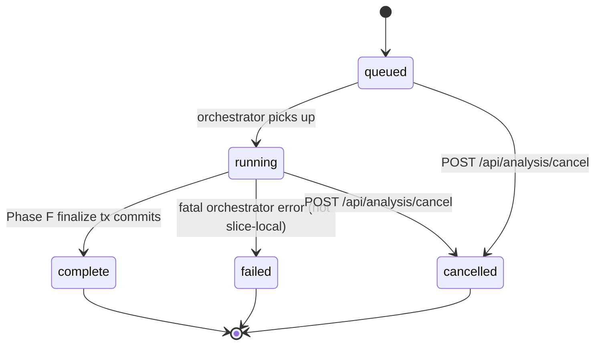
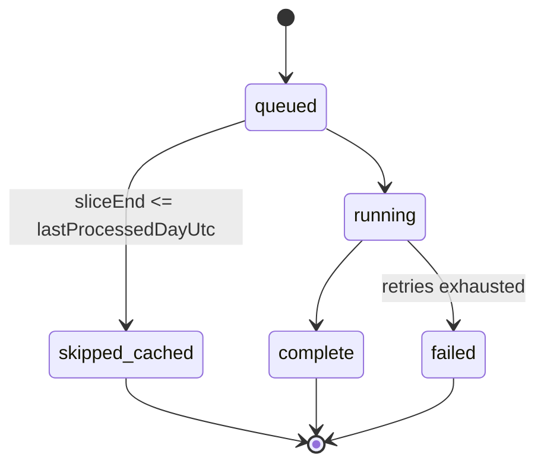

# Data Model: Analysis Engine (008-analysis-jobs)

**Feature**: `008-analysis-jobs`  
**Date**: 2026-05-24  
**Authority**: This document defines the Drizzle schema deltas that implement the Phase 0 decisions in [research.md](research.md). It does not re-litigate decisions; every persistence rule cites `research.md §RN`, the protocol research, or the feasibility doc. Identity rules follow `docs/spec/the-cab-feature-feasibility-implementation-architecture.md` §2.3: `(chainId, address)` for ownership entities, `(chainId, contract, tokenId)` for NFT positions, `(chainId, txHash, logIndex)` for on-chain events.

## Identity & Constraint Audit (REQUIRED)

Every persisted table in this feature MUST satisfy:

1. The natural-uniqueness predicate of every domain row begins with `chain_id`.
2. No `unique(address)`-style constraint without `chain_id`.
3. No `unique(tx_hash)`-style constraint without `chain_id`.
4. Surrogate `uuid` primary keys are permitted, but the canonical uniqueness constraint MUST be expressed as a separate `unique_index`.
5. Every column referenced by a Trigger.dev `idempotencyKey` (research.md §R10) MUST be present and indexed.

This audit is re-validated in Phase 2 of the plan and in the implementation checklist.

---

## 1. New Engine-Control Tables

### 1.1 `analysis_slices` (NEW)

Per-slice persistence required by FR-008, research.md §R3.

| Column | Type | Notes |
|---|---|---|
| `id` | `uuid` PK | Surrogate. |
| `run_id` | `uuid` FK → `analysis_runs.id` | Cascade on delete. |
| `wallet_address` | `varchar(42)` not null | Lowercased. |
| `chain_id` | `integer` not null | |
| `slice_index` | `integer` not null | 0 = freshest, increasing backward. |
| `slice_start_utc` | `timestamptz` not null | UTC day boundary (00:00:00Z). |
| `slice_end_utc` | `timestamptz` not null | Exclusive UTC day boundary. |
| `status` | `varchar(24)` not null default `'queued'` | enum: `queued | running | complete | skipped_cached | failed`. |
| `attempt_count` | `integer` not null default `0` | |
| `coverage_reasons_json` | `jsonb` not null default `[]` | Array of codes from controlled vocabulary (FR-031). |
| `provider_attempts_json` | `jsonb` not null default `{}` | `{ moralis: n, alchemyRpc: n, alchemyPrices: n }`. |
| `tx_count_seen` | `integer` not null default `0` | Discovered txs in this slice's window. |
| `tx_count_processed` | `integer` not null default `0` | Txs that reached decode/price. |
| `started_at` | `timestamptz` nullable | |
| `completed_at` | `timestamptz` nullable | |
| `created_at` / `updated_at` | `timestamptz` | |

**Unique index** `analysis_slices_identity_uidx` ON `(chain_id, wallet_address, slice_start_utc, slice_end_utc)`.  
**Index** `analysis_slices_run_idx` ON `(run_id, slice_index)`.  
**Index** `analysis_slices_status_idx` ON `(status)`.

**State transitions** (FR-008): `queued → running → complete | skipped_cached | failed`. Once `complete`/`skipped_cached`/`failed`, the row is terminal for that run; retries create a NEW slice row on a NEW run.

---

### 1.2 `processing_cursors` (NEW)

Per-wallet cursor (research.md §R5, FR-011, FR-017).

| Column | Type | Notes |
|---|---|---|
| `id` | `uuid` PK | Surrogate. |
| `wallet_address` | `varchar(42)` not null | Lowercased. |
| `chain_id` | `integer` not null | |
| `last_processed_day_utc` | `date` nullable | Most recent UTC day fully `complete`. |
| `last_processed_block_number` | `bigint` nullable | Best-effort upper bound for reorg tolerance. |
| `last_successful_run_id` | `uuid` FK → `analysis_runs.id` nullable | |
| `last_advanced_at` | `timestamptz` nullable | |
| `metadata_json` | `jsonb` not null default `{}` | |
| `created_at` / `updated_at` | `timestamptz` | |

**Unique index** `processing_cursors_identity_uidx` ON `(chain_id, wallet_address)`.

**Advance rule** (FR-017, FR-023): `last_processed_day_utc` advances only inside the same transaction that flips `analysis_runs.status = 'complete'` for the owning run. It advances to the latest UTC day for which **every** slice covering that day is `complete` or `skipped_cached` — never past a `failed`-slice day.

---

### 1.3 `processed_txs` (NEW)

Per-tx short-circuit index (research.md §R5, FR-012, FR-014, FR-015).

| Column | Type | Notes |
|---|---|---|
| `id` | `uuid` PK | Surrogate. |
| `chain_id` | `integer` not null | |
| `tx_hash` | `varchar(66)` not null | |
| `wallet_address` | `varchar(42)` not null | The wallet for which the tx was processed. |
| `block_number` | `bigint` not null | For 32-block reorg check. |
| `first_run_id` | `uuid` FK → `analysis_runs.id` not null | |
| `first_slice_id` | `uuid` FK → `analysis_slices.id` not null | |
| `processed_at_utc` | `timestamptz` not null | |

**Unique index** `processed_txs_identity_uidx` ON `(chain_id, tx_hash, wallet_address)`.  
**Index** `processed_txs_block_idx` ON `(chain_id, block_number)` — supports the `block_number > head - 32` re-check query.

**Reorg rule** (FR-015, FR-016): Incremental runs MUST ignore `processed_txs` rows whose `block_number > head - 32` and re-check the underlying transaction.

---

### 1.4 `strategy_exposures` (NEW)

Mellow exposure modeled as `Strategy + StrategyExposure`, never as an NFT deposit (FR-021, research.md §R7).

| Column | Type | Notes |
|---|---|---|
| `id` | `uuid` PK | |
| `chain_id` | `integer` not null | |
| `strategy_id` | `uuid` FK → `strategies.id` not null | |
| `wallet_address` | `varchar(42)` not null | |
| `wrapper_address` | `varchar(42)` not null | Per protocol research §1; the Mellow wrapper the user holds. |
| `shares_raw` | `numeric(78, 0)` not null default `'0'` | Wrapper token balance (raw uint256). |
| `underlying0_amount_raw` | `numeric(78, 0)` nullable | From `previewMint` per overview-provider-smoke-note.md. |
| `underlying1_amount_raw` | `numeric(78, 0)` nullable | |
| `valuation_block_number` | `bigint` nullable | Block at which the share-level valuation was read. |
| `coverage_status` | `varchar(24)` not null default `'share_level'` | `full | share_level | partial | unknown`. |
| `metadata_json` | `jsonb` not null default `{}` | |
| `created_at` / `updated_at` | `timestamptz` | |

**Unique index** `strategy_exposures_identity_uidx` ON `(chain_id, strategy_id, wallet_address, wrapper_address)`.

---

### 1.5 `pool_metrics_snapshots` (NEW)

Daily pool-level metrics written by Phase E (FR-052).

| Column | Type | Notes |
|---|---|---|
| `id` | `uuid` PK | |
| `chain_id` | `integer` not null | |
| `pool_id` | `uuid` FK → `pools.id` not null | |
| `day_utc` | `date` not null | UTC day boundary; daily resolution only (research.md §R4). |
| `tvl_usd` | `numeric(38, 18)` nullable | |
| `volume_24h_usd` | `numeric(38, 18)` nullable | |
| `fees_24h_usd` | `numeric(38, 18)` nullable | |
| `metadata_json` | `jsonb` not null default `{}` | |
| `created_at` | `timestamptz` | |

**Unique index** `pool_metrics_snapshots_identity_uidx` ON `(chain_id, pool_id, day_utc)`.

---

## 2. Extensions To Existing Tables

### 2.1 `analysis_runs` (EXTENDED)

Existing in `apps/web/src/server/db/schema.ts`. Apply these additions to honor research.md §R2 and FR-001/FR-002.

| Column | Type | Notes |
|---|---|---|
| `triggered_at_utc` | `timestamptz` not null default `now()` | NEW. Authoritative trigger timestamp; back-fill from `created_at` on migration. |
| `utc_day_bucket` | `date` not null | NEW. `YYYY-MM-DD`. Computed at insert from `triggered_at_utc`. |
| `coverage` | `varchar(16)` not null default `'unknown'` | NEW. enum: `full | partial | unknown`. FR-031. |
| `coverage_reasons_json` | `jsonb` not null default `[]` | NEW. Aggregated reasons from completed/failed slices. |
| `cancelled_at` | `timestamptz` nullable | NEW. Set by `POST /api/analysis/cancel` (FR-036). |
| `cancelled_reason` | `varchar(64)` nullable | NEW. Optional machine code. |

**Status enum** (FR-001): `queued | running | complete | failed | cancelled` (internal). The status-projection layer (`apps/web/src/server/analysis/status-projection.ts`) maps these to the canonical 007 vocabulary.

**Partial unique index** (FR-002):

```sql
CREATE UNIQUE INDEX analysis_runs_completed_per_day_uidx
  ON analysis_runs (chain_id, wallet_address, utc_day_bucket)
  WHERE status = 'complete';
```

This enforces "at most one `complete` run per `(walletAddress, chainId, utcDayBucket)`" at the DB layer; the Trigger.dev `idempotencyKey = run:{chainId}:{walletAddress}:{YYYY-MM-DD}` (research.md §R10) is the runtime-layer counterpart.

**Index** `analysis_runs_wallet_day_idx` ON `(chain_id, wallet_address, utc_day_bucket)` — supports same-day short-circuit lookups (FR-003).

---

### 2.2 `processed_txs` ↔ `ledger_events` ↔ `asset_movements` (chain-aware identity confirmed)

Existing schema already uses `(chain_id, tx_hash, log_index, event_type)` for `ledger_events` and `(chain_id, ledger_event_id, movement_index)` for `asset_movements`. No constraint changes; this section is the audit row confirming compliance with FR-032 / CA-004.

---

### 2.3 `deposits` (EXTENDED)

Existing schema is wallet-address-keyed only (`index deposits_wallet_idx`). Add chain-aware NFT identity (FR-020, FR-049, protocol research §3.3).

| Column | Type | Notes |
|---|---|---|
| `position_manager_address` | `varchar(42)` nullable | NEW. The Aerodrome NFT position manager that minted this `tokenId`. |
| `mint_tx_hash` | `varchar(66)` nullable | NEW. The tx that minted this `tokenId`. Distinguishes `mint()` from `increaseLiquidity(existing tokenId)`. |
| `coverage_status` | `varchar(24)` not null default `'unknown'` | NEW. `full | partial | unknown`. |

**Unique index** `deposits_identity_uidx` ON `(chain_id, position_manager_address, token_id)` WHERE `token_id IS NOT NULL AND position_manager_address IS NOT NULL`.

**`mint` vs `increaseLiquidity` rule** (FR-020, protocol research §3.3): A `Deposit` row is keyed by the originating `mint()` transaction. `increaseLiquidity(existing tokenId)` events MUST NOT create a new `Deposit`; they extend the existing lifecycle via `ledger_events`. Phase A MUST resolve the originating `mint_tx_hash` for every observed `tokenId` before inserting a new `Deposit` row.

---

### 2.4 `strategies` (EXTENDED)

Existing schema has `wrapper_address` but no chain-aware uniqueness. Add (FR-021):

**Unique index** `strategies_identity_uidx` ON `(chain_id, wrapper_address)` WHERE `wrapper_address IS NOT NULL`.

A `Strategy` row models a Mellow wrapper exposure category. Per-user shares live in `strategy_exposures` (§1.4). Strategies MUST NEVER be modeled as user-owned NFT deposits.

---

### 2.5 `pools` (NO CHANGE)

Existing `pools_chain_address_uidx` ON `(chain_id, pool_address)` already satisfies the identity rule. No delta required. Daily metrics live in `pool_metrics_snapshots` (§1.5).

---

### 2.6 `price_points` (NO CHANGE)

Existing `price_points_identity_uidx` ON `(chain_id, token_address, priced_at, source, resolution)` satisfies research.md §R4. v1 writes only rows where `resolution = 'daily'` (FR-009, FR-030). The `source` column carries `alchemy_address`, `alchemy_symbol`, or `cache` to honor address-preferred-with-symbol-fallback semantics (research.md §R8).

---

### 2.7 `raw_provider_records` (EXTENDED)

Add the canonical identity required by research.md §R8 / FR-029.

| Column | Type | Notes |
|---|---|---|
| `request_hash` | `varchar(64)` not null | NEW. SHA-256 of `(provider, endpoint, normalized request payload)`. Back-fill `unknown` then re-hash on next write. |
| `slice_id` | `uuid` FK → `analysis_slices.id` nullable | NEW. Provenance for slice-scoped calls. |
| `fetched_at` | `timestamptz` not null default `now()` | NEW. |

**Unique index** `raw_provider_records_identity_uidx` ON `(provider, endpoint, request_hash, fetched_at)`. The `fetched_at` is part of the key because the same request is intentionally re-fetched over time (cache TTL, retries); this row is append-only audit, not a cache. The Redis/`provider-cache.repository` layer remains the cache.

**Browser-exposure rule** (FR-061): `raw_provider_records` MUST NEVER be returned to the browser. Normalization happens server-side before any internal API responds.

---

### 2.8 `ledger_events` (EXTENDED)

Existing identity `(chain_id, tx_hash, log_index, event_type)` is preserved. Add (FR-051):

| Column | Type | Notes |
|---|---|---|
| `classification` | `varchar(32)` nullable | NEW. Enriched by Phase D: `manual_deposit | manual_withdrawal | rebalance_withdraw | rebalance_deposit | mellow_deposit | mellow_withdraw | strategy_deposit | strategy_withdraw | claim | other`. |
| `classification_run_id` | `uuid` FK → `analysis_runs.id` nullable | NEW. Provenance for the Phase D pass that wrote `classification`. |

**Phase D rule** (FR-019, FR-051, research.md §R6): Rebalance detection matches `decreaseLiquidity`/withdraw of token T from pool P → swap touching T → deposit into pool P within a bounded window (default 24h, configurable via `ANALYSIS_REBALANCE_WINDOW_HOURS`). The window MUST be a config constant, not a magic number (research.md §R14.3).

---

### 2.9 `reward_events` & per-day reward snapshots (EXTENDED)

Existing `reward_events_identity_uidx` ON `(chain_id, tx_hash, log_index, reward_type)` is preserved. Add per-day snapshot rows required by FR-050 in a new helper column:

| Column | Type | Notes |
|---|---|---|
| `deposit_or_strategy_id` | `uuid` nullable | NEW. Points at `deposits.id` OR `strategies.id` depending on `reward_type`. |
| `accrual_snapshot_day_utc` | `date` nullable | NEW. Present on rows that are slice-boundary unclaimed-accrual snapshots (not real claim events). |
| `is_accrual_snapshot` | `boolean` not null default `false` | NEW. Distinguishes claim events from snapshotted unclaimed accruals (research.md §R7, FR-050). |

**Unique index** `reward_events_accrual_uidx` ON `(chain_id, deposit_or_strategy_id, accrual_snapshot_day_utc)` WHERE `is_accrual_snapshot = true`. Claim events keep the existing identity index.

**Valuation precision note** (research.md §R14.5): Whether unclaimed accruals at slice end are computed via contract read at the slice-end block or extrapolated from the most recent claim is an implementation-time decision; the schema supports both via `metadata_json.valuationMethod`.

---

### 2.10 `attribution_states` & `attribution_source_lots` (EXTENDED)

Add chain-aware identity. Existing tables key off `chain_id + wallet_address` index only.

**`attribution_states`** — add `unique index attribution_states_identity_uidx ON (chain_id, wallet_address, pool_id, token_address)`. One residual row per `(wallet, pool, token)` per chain.

**`attribution_source_lots`** — add `unique index attribution_source_lots_identity_uidx ON (chain_id, source_ledger_event_id, token_address)`. One lot per source event per token.

Residual attribution MUST follow the waterfall in `docs/spec/the-cab-protocol-mechanics-research-aerodrome-mellow.md` §6. Residual does not expire by time (constitution §Data Constraints); it resolves only by observed movement.

---

### 2.11 `performance_snapshots` (EXTENDED)

Existing `performance_snapshots_wallet_idx` is an index, not a uniqueness constraint. Daily-resolution series writes (FR-053) require true upserts.

| Column | Type | Notes |
|---|---|---|
| `day_utc` | `date` not null | NEW. UTC day boundary; replaces `captured_at` as the canonical key. `captured_at` is retained for back-compat but `day_utc` is canonical going forward. |
| `resolution` | `varchar(16)` not null default `'daily'` | NEW. v1 stores only `'daily'`. |
| `coverage_status` | `varchar(24)` not null default `'unknown'` | NEW. Propagated from the producing run. |

**Unique index** `performance_snapshots_identity_uidx` ON `(chain_id, wallet_address, scope, coalesce(scope_ref_id, '00000000-0000-0000-0000-000000000000'::uuid), day_utc, resolution)`.

**Scope enum**: `portfolio | pool | deposit | strategy | rewards`. `scope_ref_id` is null for `portfolio`/`rewards`, otherwise the relevant `pool_id`/`deposit_id`/`strategy_id`.

---

### 2.12 `protocol_contracts` (NO CHANGE TO CONSTRAINTS)

Existing `protocol_contracts_chain_address_uidx` ON `(chain_id, address)` satisfies CA-004. Phase E (FR-022) writes new rows with `source = 'discovered'` and `source_reference` carrying the discovery path (e.g. `router.defaultFactory()`). Factory and gauge addresses MUST NOT be hardcoded anywhere in engine code.

---

### 2.13 `asset_movements` (NO CHANGE)

Existing `asset_movements_identity_uidx` ON `(chain_id, ledger_event_id, movement_index)` satisfies CA-004. Phase A writes rows.

---

## 3. State Machines

### 3.1 `analysis_runs.status`



Internal terminal states: `complete | failed | cancelled`. Cancellation does not advance `processing_cursors` (FR-036). `failed` does not advance it either (FR-035). Only `complete` (whether `coverage = full` or `coverage = partial`) advances the cursor, and even then only to the latest fully-`complete` UTC day (FR-017).

### 3.2 `analysis_slices.status`



A `failed` slice does not poison siblings (FR-034); Phase D/E/F still run over the slices that did complete.

### 3.3 Canonical status projection (status-projection.ts)

Internal `analysis_runs.status` → canonical 007-settings-screen R1 vocabulary returned by `GET /api/analysis/status`:

| Internal | + Condition | Canonical |
|---|---|---|
| (no row, no `walletContexts.lastAnalyzedAt`) | — | `not_analyzed` |
| `queued` | — | `queued` |
| `running` | — | `running` |
| `cancelled` | — | `not_analyzed` (if no prior `complete` run) OR last canonical state of the prior `complete` run |
| `failed` | last run failed AND no prior `complete` run | `failed` |
| `failed` | last run failed BUT prior `complete` run exists | `stale` or `ready` based on `lastSuccessfulRunAt` age |
| `complete` | `now() - completedAtUtc <= staleness window (7d)` | `ready` |
| `complete` | `now() - completedAtUtc > staleness window` | `stale` |

The engine NEVER returns `complete` or `cancelled` over the API (FR-039, FR-043).

---

## 4. Index Summary (Audit)

All UNIQUE indexes added or confirmed by this feature:

| Table | Index | Columns | Source |
|---|---|---|---|
| `analysis_runs` | `analysis_runs_completed_per_day_uidx` (partial) | `chain_id, wallet_address, utc_day_bucket` WHERE `status='complete'` | FR-002 |
| `analysis_slices` | `analysis_slices_identity_uidx` | `chain_id, wallet_address, slice_start_utc, slice_end_utc` | FR-008 |
| `processing_cursors` | `processing_cursors_identity_uidx` | `chain_id, wallet_address` | FR-011 |
| `processed_txs` | `processed_txs_identity_uidx` | `chain_id, tx_hash, wallet_address` | FR-012 |
| `strategy_exposures` | `strategy_exposures_identity_uidx` | `chain_id, strategy_id, wallet_address, wrapper_address` | FR-021 |
| `pool_metrics_snapshots` | `pool_metrics_snapshots_identity_uidx` | `chain_id, pool_id, day_utc` | FR-052 |
| `deposits` | `deposits_identity_uidx` (partial) | `chain_id, position_manager_address, token_id` | FR-020 |
| `strategies` | `strategies_identity_uidx` (partial) | `chain_id, wrapper_address` | FR-021 |
| `raw_provider_records` | `raw_provider_records_identity_uidx` | `provider, endpoint, request_hash, fetched_at` | FR-029 |
| `attribution_states` | `attribution_states_identity_uidx` | `chain_id, wallet_address, pool_id, token_address` | FR-051 |
| `attribution_source_lots` | `attribution_source_lots_identity_uidx` | `chain_id, source_ledger_event_id, token_address` | FR-051 |
| `reward_events` | `reward_events_accrual_uidx` (partial) | `chain_id, deposit_or_strategy_id, accrual_snapshot_day_utc` WHERE `is_accrual_snapshot=true` | FR-050 |
| `performance_snapshots` | `performance_snapshots_identity_uidx` | `chain_id, wallet_address, scope, coalesce(scope_ref_id, ...), day_utc, resolution` | FR-053 |

Existing UNIQUE indexes preserved without change: `pools_chain_address_uidx`, `protocol_contracts_chain_address_uidx`, `price_points_identity_uidx`, `ledger_events_identity_uidx`, `asset_movements_identity_uidx`, `reward_events_identity_uidx` (claims), `governance_events_identity_uidx`, `portfolio_snapshots_identity_uidx`, `wallet_contexts_identity_uidx`, `user_preferences_scope_key_uidx`.

**Audit result**: Zero address-only or hash-only unique constraints exist after this feature lands (SC-005).

---

## 5. Migration Plan

Generated via `pnpm db:generate` (drizzle-kit), one ordered migration:

1. ADD COLUMNs to `analysis_runs` (`triggered_at_utc`, `utc_day_bucket`, `coverage`, `coverage_reasons_json`, `cancelled_at`, `cancelled_reason`). Back-fill `triggered_at_utc = created_at`, `utc_day_bucket = date(created_at AT TIME ZONE 'UTC')`, `coverage = 'unknown'`.
2. CREATE INDEX `analysis_runs_completed_per_day_uidx` (partial) and `analysis_runs_wallet_day_idx`.
3. CREATE TABLE `analysis_slices` + indexes.
4. CREATE TABLE `processing_cursors` + index.
5. CREATE TABLE `processed_txs` + indexes.
6. CREATE TABLE `strategy_exposures` + index.
7. CREATE TABLE `pool_metrics_snapshots` + index.
8. ADD COLUMNs to `deposits` (`position_manager_address`, `mint_tx_hash`, `coverage_status`) + partial unique index.
9. ADD partial unique index on `strategies` (`strategies_identity_uidx`).
10. ADD COLUMNs to `raw_provider_records` (`request_hash`, `slice_id`, `fetched_at`) + unique index.
11. ADD COLUMNs to `ledger_events` (`classification`, `classification_run_id`).
12. ADD COLUMNs to `reward_events` (`deposit_or_strategy_id`, `accrual_snapshot_day_utc`, `is_accrual_snapshot`) + partial unique index.
13. ADD unique indexes on `attribution_states` and `attribution_source_lots`.
14. ADD COLUMNs to `performance_snapshots` (`day_utc`, `resolution`, `coverage_status`) + composite unique index.

All steps are additive; no destructive operations. The `analysis_runs.stage` and `analysis_runs.progress_pct` legacy columns remain for backward compatibility with the existing Settings UI (per `/memories/repo/settings-contract-drift.md`).

---

## 6. Open Verification Items (carried to tasks)

These do not block planning; they are flagged for implementation per research.md §R14:

- **R14.1 Mellow event coverage** — Confirm exact event set per Mellow wrapper before locking Phase A discovery (`strategy_exposures` schema supports `metadata_json.eventCoverage`).
- **R14.2 Gauge → pool discovery** for CL vs stable vs volatile pool types; cache discoveries in `protocol_contracts` with `source_reference`.
- **R14.3 Rebalance window default** — 24h is the starting value; surface as `ANALYSIS_REBALANCE_WINDOW_HOURS` env var.
- **R14.4 Trigger.dev plan sizing** — measure worst-case run-minutes against chosen plan; document self-host fallback.
- **R14.5 Unclaimed-reward valuation method** — contract read at slice-end block vs extrapolation; schema supports both via `reward_events.metadata_json.valuationMethod`.
